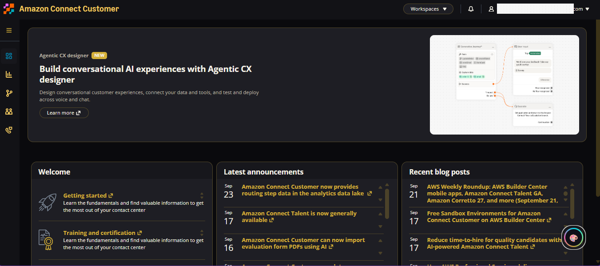
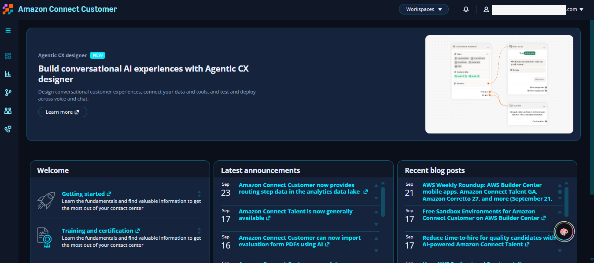
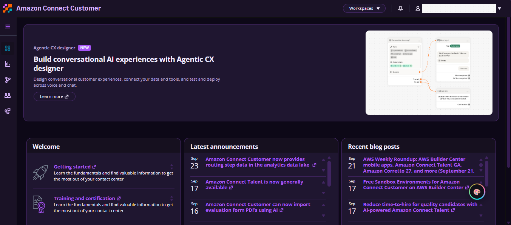
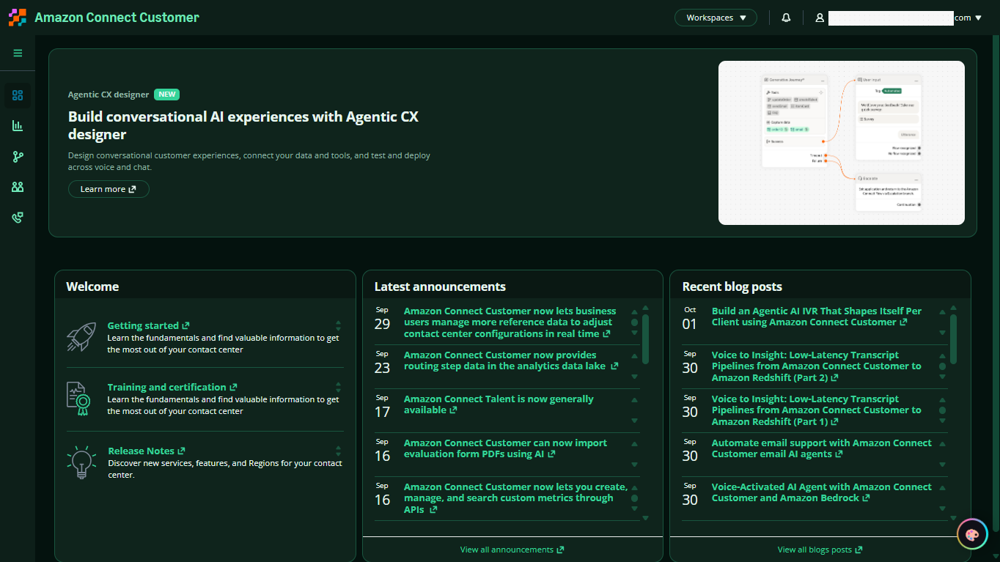
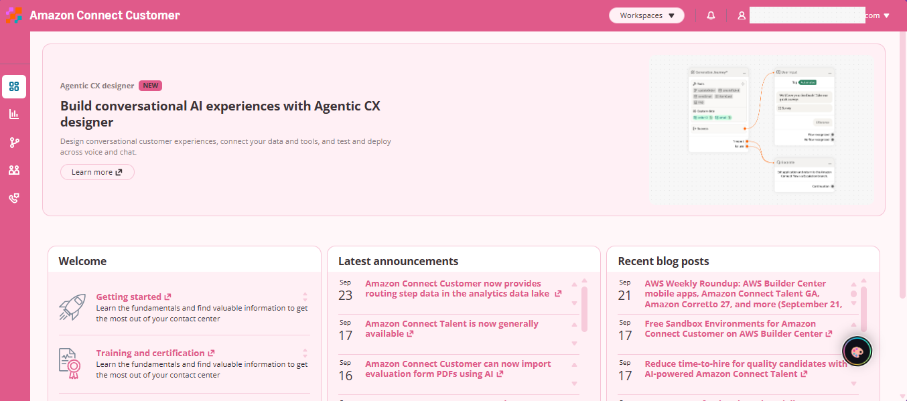
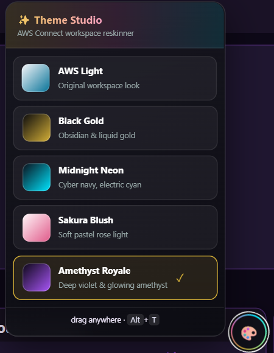

# 🎨 AWS Connect Theme Studio

  
  
  
  
  

> A Tampermonkey userscript that reskins the **Amazon Connect admin website**
> (`my.connect.aws`) with six polished themes — including full recoloring of
> legacy surfaces AWS never tokenized (Scheduling, dashboards, tables,
> sidebars, flash notifications, threshold cells).

> **🧭 Where it runs:** the **admin website** — the console supervisors, WFM
> and ops teams use daily (`my.connect.aws`: Scheduling, Analytics, Users,
> Queues). It does **not** touch the agent-facing CCP widget. Need live
> monitoring on the admin dashboards too? That's the sibling tool,
> [**AWS Magic Monitor**](https://github.com/Mkhimer69/AWS-Magic-Monitor).

## 🌈 Themes

| Theme | Look |
|---|---|
| 🌑 **Black Gold** | Obsidian + liquid gold |
| 🌃 **Midnight Neon** | Cyber navy + electric cyan |
| 💜 **Amethyst Royale** | Deep violet + glowing amethyst |
| 🟢 **Emerald Abyss** | Deep teal + glowing jade |
| 🌸 **Sakura Blush** | Soft pastel rose light |
| ☀️ **AWS Light** | Original look (clean restore) |

  
  

  
  

  
  

## 📥 Installation

1. Install [Tampermonkey](https://www.tampermonkey.net/)
2. Click: **[aws-connect-theme-studio.user.js](https://raw.githubusercontent.com/Mkhimer69/AWS-Connect-Theme-Studio/main/aws-connect-theme-studio.user.js)**
3. Tampermonkey opens → **Install**
4. Reload the Amazon Connect admin website → click the 🎨 orb (or `Alt+T`) → pick a theme

🔄 **Auto-updates** — Tampermonkey checks periodically and prompts on every new version.

## ⚙️ How It Works

| Layer | What it does |
|---|---|
| 🎛 **Token override** | Overrides CloudScape CSS custom properties with `!important` at high specificity |
| 🔍 **Dynamic token discovery** | Maps every `--color-*` var (any build hash) to theme roles — survives AWS rebuilds |
| 🧮 **Neutral-ramp mapping** | Any `--color-neutral-N` / `layout-panel` token resolves into the theme's surface ramp — kills whites on Scheduling, drawers & panes |
| 🧱 **CSSOM literal rewriter** | Recolors hardcoded legacy surfaces (`lily` micro-frontends), including adopted stylesheets |
| 🪣 **Catch-all rewriter** | Flips remaining neutral gray backgrounds/borders and muted dark text on dark themes |
| 🚨 **Status surfaces** | Flash notifications, alerts, drawers & threshold cells repainted via DOM-level inline styling |
| 🔁 **Self-healing** | MutationObserver + periodic re-assert keeps new UI themed as it renders |

## 🐛 Known Limitations

- Hidden vendor-specific widgets may use non-neutral brand colors (by design, untouched)
- If a surface stays unthemed, [open an issue](https://github.com/Mkhimer69/AWS-Connect-Theme-Studio/issues) with the CSS class name — fixes land fast

## 📄 License

MIT — © 2026 [Fathy Mkhimer](https://github.com/Mkhimer69)

---

<b>🎨 AWS Connect Theme Studio</b> <i>Your workspace. Your colors.</i>

